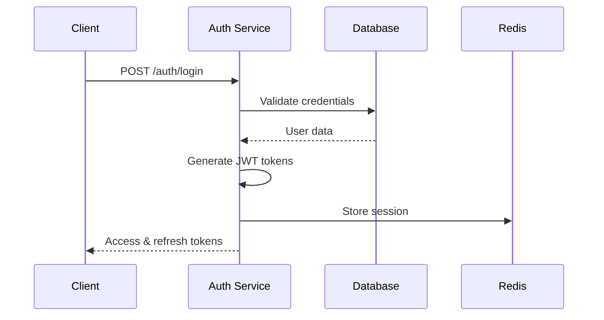
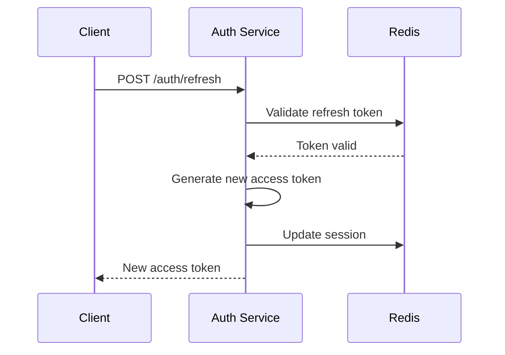

# Authentication Service Documentation

The Authentication Service handles user registration, login, token management, and security operations for the Trading Signals Reader AI Bot.

## 🔐 Overview

The authentication system provides secure access control using JWT tokens, password hashing, and multi-factor authentication support. It integrates with the main user management system and provides session handling.

## 📋 API Endpoints

### Base URL
```
/api/v1/auth
```

### Authentication Endpoints

#### 1. User Registration
```http
POST /api/v1/auth/register
```

**Request Body:**
```json
{
  "email": "user@example.com",
  "username": "john_doe",
  "password": "SecurePassword123!",
  "first_name": "John",
  "last_name": "Doe",
  "timezone": "UTC",
  "preferred_currency": "USD"
}
```

**Response:**
```json
{
  "message": "User registered successfully",
  "user_id": "550e8400-e29b-41d4-a716-446655440000",
  "verification_required": true
}
```

**Status Codes:**
- `201`: User created successfully
- `400`: Invalid input data
- `409`: User already exists
- `422`: Validation error

#### 2. User Login
```http
POST /api/v1/auth/login
```

**Request Body:**
```json
{
  "email": "user@example.com",
  "password": "SecurePassword123!",
  "remember_me": false
}
```

**Response:**
```json
{
  "access_token": "eyJhbGciOiJIUzI1NiIsInR5cCI6IkpXVCJ9...",
  "refresh_token": "eyJhbGciOiJIUzI1NiIsInR5cCI6IkpXVCJ9...",
  "token_type": "bearer",
  "expires_in": 3600,
  "user": {
    "id": "550e8400-e29b-41d4-a716-446655440000",
    "email": "user@example.com",
    "username": "john_doe",
    "is_verified": true,
    "is_premium": false
  }
}
```

**Status Codes:**
- `200`: Login successful
- `401`: Invalid credentials
- `423`: Account locked
- `429`: Too many login attempts

#### 3. Token Refresh
```http
POST /api/v1/auth/refresh
```

**Request Body:**
```json
{
  "refresh_token": "eyJhbGciOiJIUzI1NiIsInR5cCI6IkpXVCJ9..."
}
```

**Response:**
```json
{
  "access_token": "eyJhbGciOiJIUzI1NiIsInR5cCI6IkpXVCJ9...",
  "token_type": "bearer",
  "expires_in": 3600
}
```

#### 4. Logout
```http
POST /api/v1/auth/logout
```

**Headers:**
```
Authorization: Bearer <access_token>
```

**Response:**
```json
{
  "message": "Logged out successfully"
}
```

#### 5. Password Reset Request
```http
POST /api/v1/auth/password-reset
```

**Request Body:**
```json
{
  "email": "user@example.com"
}
```

**Response:**
```json
{
  "message": "Password reset email sent"
}
```

#### 6. Password Reset Confirmation
```http
POST /api/v1/auth/password-reset/confirm
```

**Request Body:**
```json
{
  "token": "reset_token_here",
  "new_password": "NewSecurePassword123!"
}
```

#### 7. Email Verification
```http
POST /api/v1/auth/verify-email
```

**Request Body:**
```json
{
  "token": "verification_token_here"
}
```

#### 8. Two-Factor Authentication Setup
```http
POST /api/v1/auth/2fa/setup
```

**Headers:**
```
Authorization: Bearer <access_token>
```

**Response:**
```json
{
  "qr_code": "data:image/png;base64,iVBORw0KGgoAAAANSUhEUgAA...",
  "secret": "JBSWY3DPEHPK3PXP",
  "backup_codes": ["12345678", "87654321", ...]
}
```

#### 9. Two-Factor Authentication Verification
```http
POST /api/v1/auth/2fa/verify
```

**Request Body:**
```json
{
  "code": "123456"
}
```

## 🔒 Security Features

### Password Security
- **Hashing Algorithm**: bcrypt with salt rounds
- **Minimum Requirements**: 8 characters, uppercase, lowercase, number, special character
- **Password History**: Prevents reuse of last 5 passwords
- **Strength Validation**: Real-time password strength checking

### Token Management
- **Access Token Lifetime**: 1 hour (configurable)
- **Refresh Token Lifetime**: 30 days (configurable)
- **Token Rotation**: Automatic refresh token rotation
- **Blacklisting**: Immediate token invalidation on logout

### Rate Limiting
- **Login Attempts**: 5 attempts per 15 minutes per IP
- **Registration**: 3 registrations per hour per IP
- **Password Reset**: 3 requests per hour per email
- **Account Lockout**: 30 minutes after 5 failed attempts

### Session Management
- **Concurrent Sessions**: Maximum 5 active sessions per user
- **Session Tracking**: IP address, user agent, device fingerprinting
- **Automatic Cleanup**: Expired sessions removed daily

## 🛡️ Security Headers

```http
X-Content-Type-Options: nosniff
X-Frame-Options: DENY
X-XSS-Protection: 1; mode=block
Strict-Transport-Security: max-age=31536000; includeSubDomains
Content-Security-Policy: default-src 'self'
```

## 📊 Authentication Flow

### Standard Login Flow


### Token Refresh Flow


## 🔧 Configuration

### Environment Variables
```bash
# JWT Configuration
JWT_SECRET_KEY=your-super-secret-jwt-key
JWT_ACCESS_TOKEN_EXPIRE_MINUTES=60
JWT_REFRESH_TOKEN_EXPIRE_DAYS=30
JWT_ALGORITHM=HS256

# Password Security
PASSWORD_MIN_LENGTH=8
PASSWORD_REQUIRE_UPPERCASE=true
PASSWORD_REQUIRE_LOWERCASE=true
PASSWORD_REQUIRE_NUMBERS=true
PASSWORD_REQUIRE_SPECIAL=true

# Rate Limiting
RATE_LIMIT_LOGIN_ATTEMPTS=5
RATE_LIMIT_LOGIN_WINDOW=900  # 15 minutes
ACCOUNT_LOCKOUT_DURATION=1800  # 30 minutes

# Two-Factor Authentication
TOTP_ISSUER_NAME="Trading Bot"
TOTP_DIGITS=6
TOTP_INTERVAL=30
```

## 🧪 Testing

### Unit Tests
```python
# Test user registration
def test_user_registration():
    response = client.post("/api/v1/auth/register", json={
        "email": "test@example.com",
        "username": "testuser",
        "password": "TestPassword123!"
    })
    assert response.status_code == 201
    assert "user_id" in response.json()

# Test login
def test_user_login():
    response = client.post("/api/v1/auth/login", json={
        "email": "test@example.com",
        "password": "TestPassword123!"
    })
    assert response.status_code == 200
    assert "access_token" in response.json()
```

### Integration Tests
```python
# Test complete authentication flow
def test_auth_flow():
    # Register user
    register_response = client.post("/api/v1/auth/register", json=user_data)
    
    # Login
    login_response = client.post("/api/v1/auth/login", json=login_data)
    access_token = login_response.json()["access_token"]
    
    # Access protected endpoint
    headers = {"Authorization": f"Bearer {access_token}"}
    protected_response = client.get("/api/v1/users/me", headers=headers)
    
    assert protected_response.status_code == 200
```

## 🚨 Error Handling

### Common Error Responses

#### Invalid Credentials (401)
```json
{
  "detail": "Invalid email or password",
  "error_code": "INVALID_CREDENTIALS",
  "timestamp": "2024-01-15T10:30:00Z"
}
```

#### Account Locked (423)
```json
{
  "detail": "Account temporarily locked due to multiple failed login attempts",
  "error_code": "ACCOUNT_LOCKED",
  "locked_until": "2024-01-15T11:00:00Z",
  "timestamp": "2024-01-15T10:30:00Z"
}
```

#### Token Expired (401)
```json
{
  "detail": "Access token has expired",
  "error_code": "TOKEN_EXPIRED",
  "timestamp": "2024-01-15T10:30:00Z"
}
```

## 📈 Monitoring

### Metrics to Track
- Login success/failure rates
- Token refresh frequency
- Account lockout incidents
- 2FA adoption rate
- Session duration statistics
- Failed authentication attempts by IP

### Alerts
- High number of failed login attempts
- Unusual login patterns
- Token validation failures
- Account lockout spikes

---

*This documentation covers the complete authentication service functionality, providing secure access control for the Trading Signals Reader AI Bot platform.*