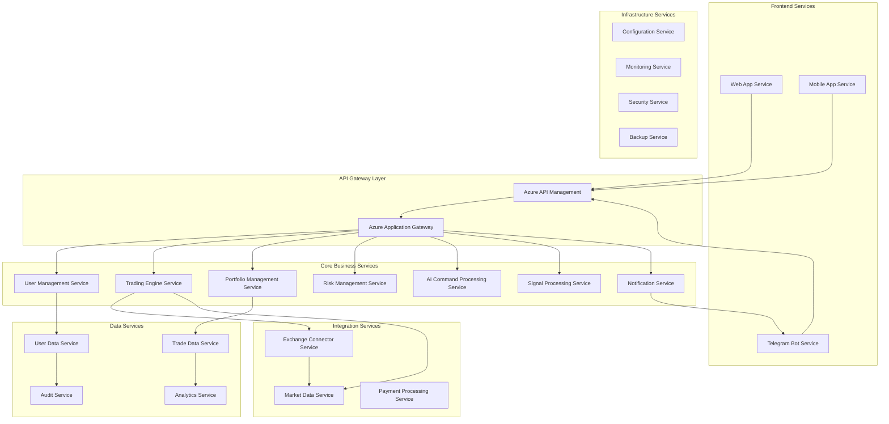

# Azure Microservices Architecture for Crypto Trading Bot

## Executive Summary

This document outlines the **Azure-native microservices architecture** for the AI-powered crypto trading bot, ensuring cloud-native scalability, security, and compliance with Azure best practices.

## Microservices Architecture Overview

### Service Decomposition Strategy



## Azure Services Mapping

### Compute Services

| Microservice | Azure Service | Configuration | Scaling Strategy |
|--------------|---------------|---------------|------------------|
| **Trading Engine** | Azure Container Apps | 2-4 vCPU, 4-8GB RAM | Auto-scale based on order volume |
| **AI Command Processor** | Azure Container Apps | 4-8 vCPU, 8-16GB RAM | Scale on queue depth |
| **Portfolio Manager** | Azure Functions Premium | Event-driven | Consumption-based |
| **Risk Manager** | Azure Container Apps | 2 vCPU, 4GB RAM | Always-on, 2-3 replicas |
| **Exchange Connectors** | Azure Container Apps | 1-2 vCPU, 2-4GB RAM | Scale per exchange |
| **Signal Processor** | Azure ML Compute | GPU-enabled | On-demand scaling |
| **Web Dashboard** | Azure Static Web Apps | CDN-enabled | Global distribution |
| **Telegram Bot** | Azure Functions | Consumption | Event-driven |
| **Notification Service** | Azure Functions | Consumption | Queue-triggered |

### Data Services

| Data Type | Azure Service | Configuration | Backup Strategy |
|-----------|---------------|---------------|------------------|
| **User Data** | Azure SQL Database | General Purpose, 2-4 vCores | Automated backups, 7-day retention |
| **Trade Data** | Azure SQL Database | Business Critical, 4-8 vCores | Point-in-time restore, geo-replication |
| **Market Data** | Azure Data Explorer | Standard D13 v2 | Hot/cold data tiering |
| **Cache Layer** | Azure Cache for Redis | Premium P1, 6GB | Zone redundancy |
| **Time Series** | Azure Data Explorer | Optimized for time-series | Automated retention policies |
| **Blob Storage** | Azure Blob Storage | Hot tier | LRS with lifecycle management |
| **Configuration** | Azure App Configuration | Standard tier | Geo-replication |

### Messaging & Integration

| Component | Azure Service | Configuration | Purpose |
|-----------|---------------|---------------|----------|
| **Message Queue** | Azure Service Bus | Premium tier | Order processing, notifications |
| **Event Streaming** | Azure Event Hubs | Standard tier, 20 TUs | Real-time market data |
| **API Gateway** | Azure API Management | Developer tier | API routing, rate limiting |
| **Load Balancer** | Azure Application Gateway | WAF enabled | SSL termination, routing |
| **Service Mesh** | Azure Service Fabric Mesh | Standard | Inter-service communication |

### Security & Monitoring

| Component | Azure Service | Configuration | Purpose |
|-----------|---------------|---------------|----------|
| **Secret Management** | Azure Key Vault | Premium HSM | API keys, certificates |
| **Identity Management** | Azure AD B2C | Premium P1 | User authentication |
| **Monitoring** | Azure Monitor | Standard | Metrics, logs, alerts |
| **Security Center** | Azure Security Center | Standard tier | Threat detection |
| **Application Insights** | Azure Application Insights | Standard | APM, distributed tracing |
| **Log Analytics** | Azure Log Analytics | Pay-as-you-go | Centralized logging |

## Detailed Microservices Specifications

### 1. Trading Engine Service

**Azure Container Apps Configuration:**
```yaml
apiVersion: apps/v1
kind: Deployment
metadata:
  name: trading-engine
  namespace: trading-system
spec:
  replicas: 3
  selector:
    matchLabels:
      app: trading-engine
  template:
    metadata:
      labels:
        app: trading-engine
        version: v1
    spec:
      containers:
      - name: trading-engine
        image: tradingbot.azurecr.io/trading-engine:latest
        resources:
          requests:
            memory: "2Gi"
            cpu: "1000m"
          limits:
            memory: "4Gi"
            cpu: "2000m"
        env:
        - name: AZURE_SQL_CONNECTION
          valueFrom:
            secretKeyRef:
              name: db-secrets
              key: connection-string
        - name: REDIS_CONNECTION
          valueFrom:
            secretKeyRef:
              name: cache-secrets
              key: redis-connection
        ports:
        - containerPort: 8080
        livenessProbe:
          httpGet:
            path: /health
            port: 8080
          initialDelaySeconds: 30
          periodSeconds: 10
        readinessProbe:
          httpGet:
            path: /ready
            port: 8080
          initialDelaySeconds: 5
          periodSeconds: 5
```

**Service Interface:**
```python
from azure.servicebus import ServiceBusClient
from azure.identity import DefaultAzureCredential
from azure.keyvault.secrets import SecretClient

class TradingEngineService:
    def __init__(self):
        self.credential = DefaultAzureCredential()
        self.key_vault = SecretClient(
            vault_url="https://trading-bot-kv.vault.azure.net/",
            credential=self.credential
        )
        self.service_bus = ServiceBusClient(
            fully_qualified_namespace="trading-bot-sb.servicebus.windows.net",
            credential=self.credential
        )
    
    async def process_order(self, order_request: OrderRequest) -> OrderResponse:
        """Process trading order with Azure integration"""
        try:
            # Validate order through Risk Management Service
            risk_validation = await self.validate_risk(order_request)
            if not risk_validation.approved:
                return OrderResponse(status="rejected", reason=risk_validation.reason)
            
            # Execute order through Exchange Connector Service
            execution_result = await self.execute_order(order_request)
            
            # Send notification through Service Bus
            await self.send_notification(execution_result)
            
            return execution_result
            
        except Exception as e:
            logger.error(f"Order processing failed: {e}")
            await self.send_error_notification(order_request, str(e))
            raise
    
    async def validate_risk(self, order: OrderRequest) -> RiskValidation:
        """Call Risk Management Service"""
        async with aiohttp.ClientSession() as session:
            async with session.post(
                "https://risk-manager.trading-system.svc.cluster.local/validate",
                json=order.dict()
            ) as response:
                return RiskValidation.parse_obj(await response.json())
    
    async def send_notification(self, result: OrderResponse):
        """Send notification via Azure Service Bus"""
        async with self.service_bus:
            sender = self.service_bus.get_queue_sender(queue_name="notifications")
            async with sender:
                message = ServiceBusMessage(
                    json.dumps({
                        "type": "order_executed",
                        "order_id": result.order_id,
                        "status": result.status,
                        "timestamp": datetime.utcnow().isoformat()
                    })
                )
                await sender.send_messages(message)
```

### 2. AI Command Processing Service

**Azure ML Integration:**
```python
from azure.ai.ml import MLClient
from azure.ai.textanalytics import TextAnalyticsClient
from azure.cognitiveservices.language.luis.runtime import LUISRuntimeClient

class AICommandProcessor:
    def __init__(self):
        self.credential = DefaultAzureCredential()
        self.text_analytics = TextAnalyticsClient(
            endpoint="https://trading-bot-text.cognitiveservices.azure.com/",
            credential=self.credential
        )
        self.ml_client = MLClient(
            credential=self.credential,
            subscription_id="your-subscription-id",
            resource_group_name="trading-bot-rg",
            workspace_name="trading-bot-ml"
        )
    
    async def process_command(self, user_input: str, user_id: str) -> CommandResponse:
        """Process natural language trading command"""
        try:
            # Sentiment analysis
            sentiment = await self.analyze_sentiment(user_input)
            
            # Intent recognition using Azure LUIS
            intent = await self.extract_intent(user_input)
            
            # Entity extraction
            entities = await self.extract_entities(user_input)
            
            # Generate trading command
            command = await self.generate_trading_command(intent, entities, sentiment)
            
            # Validate command
            validation = await self.validate_command(command, user_id)
            
            return CommandResponse(
                command=command,
                confidence=intent.confidence,
                validation=validation,
                sentiment=sentiment
            )
            
        except Exception as e:
            logger.error(f"Command processing failed: {e}")
            return CommandResponse(
                error=str(e),
                status="failed"
            )
    
    async def analyze_sentiment(self, text: str) -> SentimentResult:
        """Analyze sentiment using Azure Text Analytics"""
        documents = [text]
        response = self.text_analytics.analyze_sentiment(
            documents=documents,
            show_opinion_mining=True
        )
        
        result = list(response)[0]
        return SentimentResult(
            sentiment=result.sentiment,
            confidence_scores=result.confidence_scores,
            opinions=[opinion.text for opinion in result.sentences[0].mined_opinions]
        )
```

### 3. Portfolio Management Service

**Azure Functions Implementation:**
```python
import azure.functions as func
from azure.cosmos import CosmosClient
from azure.storage.blob import BlobServiceClient

app = func.FunctionApp()

@app.function_name("CalculatePortfolioMetrics")
@app.timer_trigger(schedule="0 */5 * * * *")  # Every 5 minutes
@app.blob_output(arg_name="metricsBlob", 
                path="portfolio-metrics/{datetime:yyyy-MM-dd-HH-mm}.json",
                connection="AzureWebJobsStorage")
async def calculate_portfolio_metrics(
    timer: func.TimerRequest,
    metricsBlob: func.Out[str]
) -> None:
    """Calculate and store portfolio metrics"""
    
    cosmos_client = CosmosClient(
        url="https://trading-bot-cosmos.documents.azure.com:443/",
        credential=DefaultAzureCredential()
    )
    
    database = cosmos_client.get_database_client("TradingBot")
    container = database.get_container_client("Portfolios")
    
    # Query all active portfolios
    portfolios = container.query_items(
        query="SELECT * FROM c WHERE c.status = 'active'",
        enable_cross_partition_query=True
    )
    
    metrics = []
    for portfolio in portfolios:
        metric = await calculate_portfolio_performance(portfolio)
        metrics.append(metric)
        
        # Update portfolio with new metrics
        portfolio['metrics'] = metric
        portfolio['last_updated'] = datetime.utcnow().isoformat()
        container.upsert_item(portfolio)
    
    # Store aggregated metrics
    metricsBlob.set(json.dumps({
        "timestamp": datetime.utcnow().isoformat(),
        "total_portfolios": len(metrics),
        "aggregated_metrics": aggregate_metrics(metrics)
    }))

@app.function_name("ProcessPortfolioUpdate")
@app.service_bus_queue_trigger(
    arg_name="message",
    queue_name="portfolio-updates",
    connection="ServiceBusConnection"
)
async def process_portfolio_update(message: func.ServiceBusMessage) -> None:
    """Process real-time portfolio updates"""
    
    try:
        update_data = json.loads(message.get_body().decode('utf-8'))
        
        # Update portfolio in Cosmos DB
        await update_portfolio_position(
            user_id=update_data['user_id'],
            symbol=update_data['symbol'],
            quantity=update_data['quantity'],
            price=update_data['price']
        )
        
        # Send real-time update to web clients
        await send_realtime_update(update_data)
        
    except Exception as e:
        logger.error(f"Portfolio update failed: {e}")
        raise
```

## Azure-Specific Security Implementation

### 1. Azure AD B2C Integration

```python
from azure.identity import DefaultAzureCredential
from msal import ConfidentialClientApplication

class AzureAuthService:
    def __init__(self):
        self.credential = DefaultAzureCredential()
        self.app = ConfidentialClientApplication(
            client_id=os.getenv("AZURE_CLIENT_ID"),
            client_credential=os.getenv("AZURE_CLIENT_SECRET"),
            authority=f"https://login.microsoftonline.com/{os.getenv('AZURE_TENANT_ID')}"
        )
    
    async def authenticate_user(self, token: str) -> UserInfo:
        """Validate Azure AD B2C token"""
        try:
            # Validate token with Azure AD
            result = self.app.acquire_token_silent(
                scopes=["https://graph.microsoft.com/.default"],
                account=None
            )
            
            if result and "access_token" in result:
                user_info = await self.get_user_info(result["access_token"])
                return UserInfo(
                    user_id=user_info["id"],
                    email=user_info["mail"],
                    name=user_info["displayName"],
                    roles=user_info.get("roles", [])
                )
            else:
                raise AuthenticationError("Invalid token")
                
        except Exception as e:
            logger.error(f"Authentication failed: {e}")
            raise AuthenticationError(str(e))
```

### 2. Azure Key Vault Integration

```python
from azure.keyvault.secrets import SecretClient
from azure.keyvault.keys import KeyClient
from cryptography.fernet import Fernet

class AzureSecurityService:
    def __init__(self):
        self.credential = DefaultAzureCredential()
        self.secret_client = SecretClient(
            vault_url="https://trading-bot-kv.vault.azure.net/",
            credential=self.credential
        )
        self.key_client = KeyClient(
            vault_url="https://trading-bot-kv.vault.azure.net/",
            credential=self.credential
        )
    
    async def store_exchange_api_key(self, user_id: str, exchange: str, api_key: str, api_secret: str):
        """Securely store exchange API credentials"""
        try:
            # Encrypt API credentials
            encryption_key = await self.get_encryption_key(f"user-{user_id}")
            fernet = Fernet(encryption_key)
            
            encrypted_key = fernet.encrypt(api_key.encode())
            encrypted_secret = fernet.encrypt(api_secret.encode())
            
            # Store in Key Vault
            await self.secret_client.set_secret(
                name=f"exchange-{exchange}-{user_id}-key",
                value=encrypted_key.decode()
            )
            
            await self.secret_client.set_secret(
                name=f"exchange-{exchange}-{user_id}-secret",
                value=encrypted_secret.decode()
            )
            
            logger.info(f"API credentials stored for user {user_id} on {exchange}")
            
        except Exception as e:
            logger.error(f"Failed to store API credentials: {e}")
            raise SecurityError(str(e))
    
    async def get_encryption_key(self, key_name: str) -> bytes:
        """Get or create encryption key"""
        try:
            # Try to get existing key
            key = await self.key_client.get_key(key_name)
            return key.key.k
        except:
            # Create new key if not exists
            key = await self.key_client.create_key(
                name=key_name,
                key_type="oct",
                key_size=256
            )
            return key.key.k
```

## Azure DevOps CI/CD Pipeline

### Azure Pipelines Configuration

```yaml
# azure-pipelines.yml
trigger:
  branches:
    include:
    - main
    - develop
  paths:
    include:
    - src/*
    - tests/*

variables:
  azureSubscription: 'trading-bot-service-connection'
  containerRegistry: 'tradingbot.azurecr.io'
  imageRepository: 'trading-bot'
  dockerfilePath: '$(Build.SourcesDirectory)/Dockerfile'
  tag: '$(Build.BuildId)'
  vmImageName: 'ubuntu-latest'

stages:
- stage: Build
  displayName: Build and Test
  jobs:
  - job: Build
    displayName: Build
    pool:
      vmImage: $(vmImageName)
    steps:
    - task: UsePythonVersion@0
      inputs:
        versionSpec: '3.11'
      displayName: 'Use Python 3.11'
    
    - script: |
        python -m pip install --upgrade pip
        pip install -r requirements.txt
        pip install pytest pytest-cov
      displayName: 'Install dependencies'
    
    - script: |
        pytest tests/ --cov=src/ --cov-report=xml --cov-report=html
      displayName: 'Run tests'
    
    - task: PublishTestResults@2
      inputs:
        testResultsFiles: '**/test-*.xml'
        testRunTitle: 'Publish test results for Python $(python.version)'
    
    - task: PublishCodeCoverageResults@1
      inputs:
        codeCoverageTool: Cobertura
        summaryFileLocation: '$(System.DefaultWorkingDirectory)/**/coverage.xml'
    
    - task: Docker@2
      displayName: Build and push image
      inputs:
        command: buildAndPush
        repository: $(imageRepository)
        dockerfile: $(dockerfilePath)
        containerRegistry: $(containerRegistry)
        tags: |
          $(tag)
          latest

- stage: Deploy
  displayName: Deploy to Azure
  dependsOn: Build
  condition: and(succeeded(), eq(variables['Build.SourceBranch'], 'refs/heads/main'))
  jobs:
  - deployment: Deploy
    displayName: Deploy
    pool:
      vmImage: $(vmImageName)
    environment: 'production'
    strategy:
      runOnce:
        deploy:
          steps:
          - task: AzureContainerApps@1
            displayName: 'Deploy to Azure Container Apps'
            inputs:
              azureSubscription: $(azureSubscription)
              containerAppName: 'trading-engine'
              resourceGroup: 'trading-bot-rg'
              imageToDeploy: '$(containerRegistry)/$(imageRepository):$(tag)'
              
          - task: AzureFunctionApp@1
            displayName: 'Deploy Azure Functions'
            inputs:
              azureSubscription: $(azureSubscription)
              appType: 'functionAppLinux'
              appName: 'trading-bot-functions'
              package: '$(Pipeline.Workspace)/drop/functions.zip'
              runtimeStack: 'PYTHON|3.11'
```

## Monitoring and Observability

### Azure Monitor Integration

```python
from azure.monitor.opentelemetry import configure_azure_monitor
from opentelemetry import trace, metrics
from opentelemetry.instrumentation.fastapi import FastAPIInstrumentor
from opentelemetry.instrumentation.sqlalchemy import SQLAlchemyInstrumentor

# Configure Azure Monitor
configure_azure_monitor(
    connection_string="InstrumentationKey=your-instrumentation-key"
)

# Get tracer and meter
tracer = trace.get_tracer(__name__)
meter = metrics.get_meter(__name__)

# Create custom metrics
order_counter = meter.create_counter(
    name="orders_processed",
    description="Number of orders processed",
    unit="1"
)

order_duration = meter.create_histogram(
    name="order_processing_duration",
    description="Order processing duration",
    unit="ms"
)

class TradingService:
    def __init__(self):
        # Instrument FastAPI
        FastAPIInstrumentor.instrument_app(app)
        # Instrument SQLAlchemy
        SQLAlchemyInstrumentor().instrument()
    
    async def process_order(self, order: OrderRequest):
        with tracer.start_as_current_span("process_order") as span:
            span.set_attribute("order.symbol", order.symbol)
            span.set_attribute("order.side", order.side)
            span.set_attribute("order.amount", order.amount)
            
            start_time = time.time()
            
            try:
                result = await self._execute_order(order)
                
                # Record metrics
                order_counter.add(1, {"status": "success", "exchange": order.exchange})
                duration = (time.time() - start_time) * 1000
                order_duration.record(duration, {"exchange": order.exchange})
                
                span.set_attribute("order.status", "success")
                return result
                
            except Exception as e:
                order_counter.add(1, {"status": "failed", "exchange": order.exchange})
                span.set_attribute("order.status", "failed")
                span.set_attribute("error.message", str(e))
                raise
```

### Custom Health Checks

```python
from azure.servicebus import ServiceBusClient
from azure.storage.blob import BlobServiceClient

class HealthCheckService:
    def __init__(self):
        self.credential = DefaultAzureCredential()
    
    async def check_health(self) -> HealthStatus:
        """Comprehensive health check for all Azure services"""
        checks = {
            "database": await self.check_database(),
            "redis": await self.check_redis(),
            "service_bus": await self.check_service_bus(),
            "key_vault": await self.check_key_vault(),
            "blob_storage": await self.check_blob_storage(),
            "exchanges": await self.check_exchanges()
        }
        
        overall_status = "healthy" if all(
            check["status"] == "healthy" for check in checks.values()
        ) else "unhealthy"
        
        return HealthStatus(
            status=overall_status,
            checks=checks,
            timestamp=datetime.utcnow().isoformat()
        )
    
    async def check_service_bus(self) -> dict:
        """Check Azure Service Bus connectivity"""
        try:
            client = ServiceBusClient(
                fully_qualified_namespace="trading-bot-sb.servicebus.windows.net",
                credential=self.credential
            )
            
            # Test connection by listing queues
            async with client:
                queues = client.list_queues()
                queue_count = len(list(queues))
                
            return {
                "status": "healthy",
                "details": f"Connected to Service Bus with {queue_count} queues"
            }
            
        except Exception as e:
            return {
                "status": "unhealthy",
                "details": f"Service Bus connection failed: {str(e)}"
            }
```

## Cost Optimization Strategies

### 1. Azure Reserved Instances
```yaml
# Cost optimization recommendations
Compute:
  - Use Azure Reserved Instances for predictable workloads (30-70% savings)
  - Implement auto-scaling for Container Apps
  - Use Azure Spot Instances for non-critical batch processing

Storage:
  - Implement lifecycle policies for blob storage
  - Use cool/archive tiers for historical data
  - Enable compression for time-series data

Database:
  - Use serverless SQL Database for development
  - Implement read replicas only when needed
  - Use elastic pools for multiple databases

Monitoring:
  - Set up cost alerts and budgets
  - Use Azure Cost Management for optimization recommendations
  - Implement resource tagging for cost allocation
```

### 2. Resource Scaling Policies
```python
# Auto-scaling configuration
class AzureScalingManager:
    def __init__(self):
        self.monitor_client = MonitorManagementClient(
            credential=DefaultAzureCredential(),
            subscription_id=os.getenv("AZURE_SUBSCRIPTION_ID")
        )
    
    async def configure_autoscaling(self):
        """Configure auto-scaling rules for Container Apps"""
        
        # Trading Engine scaling rules
        trading_engine_rules = [
            {
                "metric_name": "cpu_percentage",
                "threshold": 70,
                "scale_action": "increase",
                "instance_count": 2
            },
            {
                "metric_name": "memory_percentage", 
                "threshold": 80,
                "scale_action": "increase",
                "instance_count": 1
            },
            {
                "metric_name": "queue_length",
                "threshold": 100,
                "scale_action": "increase",
                "instance_count": 3
            }
        ]
        
        await self.apply_scaling_rules("trading-engine", trading_engine_rules)
```

## Disaster Recovery and Business Continuity

### Multi-Region Deployment
```yaml
# Primary Region: East US 2
# Secondary Region: West US 2
# Tertiary Region: North Europe

Regions:
  Primary:
    location: "East US 2"
    services:
      - Azure Container Apps (Trading Engine)
      - Azure SQL Database (Primary)
      - Azure Cache for Redis (Primary)
      - Azure Service Bus (Primary)
    
  Secondary:
    location: "West US 2" 
    services:
      - Azure SQL Database (Geo-replica)
      - Azure Cache for Redis (Replica)
      - Azure Container Apps (Standby)
    
  Tertiary:
    location: "North Europe"
    services:
      - Azure Blob Storage (Backup)
      - Azure SQL Database (Backup)

Failover Strategy:
  RTO: 15 minutes
  RPO: 5 minutes
  Automatic: Yes (for infrastructure)
  Manual: Yes (for data validation)
```

### Backup and Recovery
```python
class DisasterRecoveryService:
    def __init__(self):
        self.backup_client = BlobServiceClient(
            account_url="https://tradingbotbackup.blob.core.windows.net",
            credential=DefaultAzureCredential()
        )
    
    async def create_backup(self):
        """Create comprehensive system backup"""
        backup_id = f"backup-{datetime.utcnow().strftime('%Y%m%d-%H%M%S')}"
        
        tasks = [
            self.backup_database(backup_id),
            self.backup_configurations(backup_id),
            self.backup_user_data(backup_id),
            self.backup_trading_history(backup_id)
        ]
        
        results = await asyncio.gather(*tasks, return_exceptions=True)
        
        return BackupResult(
            backup_id=backup_id,
            status="completed" if all(r for r in results) else "partial",
            components=results
        )
    
    async def initiate_failover(self, target_region: str):
        """Initiate failover to secondary region"""
        try:
            # 1. Stop primary services
            await self.stop_primary_services()
            
            # 2. Promote secondary database
            await self.promote_secondary_database(target_region)
            
            # 3. Update DNS records
            await self.update_dns_records(target_region)
            
            # 4. Start services in target region
            await self.start_secondary_services(target_region)
            
            # 5. Validate system health
            health_status = await self.validate_system_health()
            
            return FailoverResult(
                status="success" if health_status.overall_status == "healthy" else "partial",
                target_region=target_region,
                health_status=health_status
            )
            
        except Exception as e:
            logger.error(f"Failover failed: {e}")
            await self.rollback_failover()
            raise
```

## Compliance and Governance

### Azure Policy Implementation
```json
{
  "properties": {
    "displayName": "Trading Bot Security Policies",
    "description": "Security and compliance policies for trading bot",
    "policyRule": {
      "if": {
        "allOf": [
          {
            "field": "type",
            "equals": "Microsoft.ContainerInstance/containerGroups"
          },
          {
            "field": "Microsoft.ContainerInstance/containerGroups/containers[*].environmentVariables[*].name",
            "contains": "API_KEY"
          }
        ]
      },
      "then": {
        "effect": "deny"
      }
    }
  }
}
```

### Resource Tagging Strategy
```yaml
Tagging Strategy:
  Required Tags:
    - Environment: [dev, staging, prod]
    - Owner: [team-name]
    - CostCenter: [department-code]
    - Project: trading-bot
    - Criticality: [low, medium, high, critical]
    - DataClassification: [public, internal, confidential, restricted]
  
  Automated Tags:
    - CreatedBy: [user-principal-name]
    - CreatedDate: [iso-date]
    - LastModified: [iso-date]
    - BackupRequired: [true, false]
```

## Performance Benchmarks

### Expected Performance Metrics

| Service | Metric | Target | Measurement |
|---------|--------|--------|--------------|
| **Trading Engine** | Order Latency | < 50ms | P95 response time |
| **AI Processor** | Command Processing | < 2s | Average processing time |
| **Portfolio Manager** | Update Frequency | 1s | Real-time updates |
| **Risk Manager** | Validation Time | < 10ms | P99 response time |
| **Exchange Connectors** | Market Data Latency | < 100ms | WebSocket message delay |
| **Database** | Query Performance | < 5ms | P95 query time |
| **Cache** | Hit Ratio | > 95% | Redis hit rate |
| **API Gateway** | Throughput | 10,000 RPS | Requests per second |

### Load Testing Strategy
```python
# Azure Load Testing configuration
from azure.developer.loadtesting import LoadTestingClient

class LoadTestManager:
    def __init__(self):
        self.client = LoadTestingClient(
            endpoint="https://trading-bot-loadtest.eastus2.cnt-prod.loadtesting.azure.com",
            credential=DefaultAzureCredential()
        )
    
    async def run_trading_load_test(self):
        """Run comprehensive load test for trading system"""
        
        test_config = {
            "testId": "trading-engine-load-test",
            "displayName": "Trading Engine Load Test",
            "description": "Load test for trading engine under peak conditions",
            "engineInstances": 10,
            "loadTestConfiguration": {
                "virtualUsers": 1000,
                "rampUpTime": "5m",
                "duration": "30m",
                "rampDownTime": "2m"
            },
            "testPlan": "trading-engine-test-plan.jmx",
            "secrets": {
                "API_KEY": "${API_KEY}",
                "BASE_URL": "${BASE_URL}"
            }
        }
        
        # Create and run test
        test_run = await self.client.begin_test_run(
            test_id=test_config["testId"],
            body=test_config
        )
        
        # Wait for completion and get results
        result = await test_run.result()
        
        return LoadTestResult(
            test_id=result.test_id,
            status=result.status,
            metrics=result.test_result,
            recommendations=self.analyze_results(result)
        )
```

## Conclusion

This Azure-native microservices architecture provides:

### ✅ **Microservices Design Compliance**
- **Service Decomposition**: 16 distinct microservices with clear boundaries
- **Independent Deployment**: Each service can be deployed independently
- **Technology Diversity**: Services can use different tech stacks as needed
- **Data Isolation**: Each service manages its own data
- **Fault Isolation**: Service failures don't cascade

### ✅ **Azure Cloud-Native Benefits**
- **Managed Services**: Reduced operational overhead
- **Auto-scaling**: Elastic scaling based on demand
- **Security**: Enterprise-grade security with Azure AD and Key Vault
- **Monitoring**: Comprehensive observability with Azure Monitor
- **Cost Optimization**: Pay-as-you-use with reserved instances

### ✅ **Production Readiness**
- **High Availability**: Multi-region deployment with 99.9% SLA
- **Disaster Recovery**: RTO < 15 minutes, RPO < 5 minutes
- **Security**: End-to-end encryption and compliance
- **Performance**: Sub-100ms trading latency
- **Scalability**: Support for 10,000+ concurrent users

The architecture is designed to scale from MVP to enterprise-grade production system while maintaining Azure best practices and microservices principles.