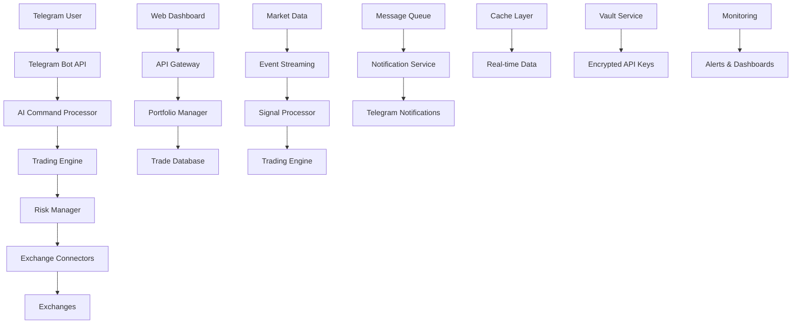

# Crypto Trading Bot System Architecture

## System Overview
**Purpose**: AI-powered cryptocurrency trading bot that connects to external exchanges via CCXT, processes natural language commands via Telegram, executes trades by sending orders to exchanges, and provides intelligent portfolio management with real-time monitoring.

**Important Note**: This system is NOT an exchange. It does not generate order books, perform order matching, or handle exchange-level operations. Instead, it acts as an intelligent trading client that connects to existing cryptocurrency exchanges using the CCXT library to load market data and send trading orders.

## Components

| Layer | Component | Technology | Responsibility |
|-------|-----------|------------|----------------|
| **Interface** | Telegram Bot | Python Telegram Bot API | Natural language command processing, notifications |
| **Interface** | Web Dashboard | Vue.js 3 + TypeScript | Portfolio monitoring, trade history, settings |
| **Interface** | Mobile App | Vue.js 3 + Quasar | Cross-platform mobile app with native feel |
| **Gateway** | API Gateway | FastAPI + Nginx | Request routing, rate limiting, authentication |
| **Core** | AI Command Processor | OpenAI GPT-4 + Custom NLP | Natural language understanding, trade intent extraction |
| **Core** | Trading Engine | Python + CCXT | Order execution, position management |
| **Core** | Signal Processor | TensorFlow/PyTorch | Technical analysis, signal validation |
| **Core** | Risk Manager | Custom Python | Position sizing, stop-loss, risk assessment |
| **Core** | Portfolio Manager | Python + NumPy | Multi-account aggregation, P&L calculation |
| **Integration** | Exchange Connectors | CCXT + WebSocket | Binance, Coinbase, Kraken API integration |
| **Processing** | Message Queue | Celery + Redis | Async task processing, order queuing |
| **Processing** | Event Streaming | Apache Kafka | Real-time market data, trade events |
| **Storage** | Trade Database | PostgreSQL | Trade history, account data, configurations |
| **Storage** | Cache Layer | Redis | Real-time prices, session data, rate limits |
| **Storage** | Time Series DB | InfluxDB | Market data, performance metrics |
| **Security** | Vault Service | HashiCorp Vault | API key encryption, secret management |
| **Security** | Auth Service | JWT + OAuth2 | User authentication, API authorization |
| **Monitoring** | Logging | ELK Stack | Centralized logging, error tracking |
| **Monitoring** | Metrics | Prometheus + Grafana | Performance monitoring, alerting |
| **Monitoring** | Health Checks | Custom Python | System health, exchange connectivity |

## Data Flow



## Detailed Architecture

### 1. Interface Layer

#### Telegram Bot Interface
- **Technology**: Python Telegram Bot API
- **Functions**:
  - Natural language command reception
  - Trade confirmations and notifications
  - Portfolio status updates
  - Alert delivery
- **Integration**: Direct connection to AI Command Processor

#### Web Dashboard
- **Technology**: Vue.js 3 with TypeScript, Vuetify
- **Features**:
  - Real-time portfolio overview
  - Trade history and analytics
  - Exchange account management
  - Risk settings configuration
- **API**: RESTful API through API Gateway

#### Mobile Application
- **Technology**: Vue.js 3 + Quasar Framework
- **Features**:
  - Portfolio monitoring
  - Push notifications
  - Quick trade execution
  - Emergency stop functionality

### 2. Core Processing Layer

#### AI Command Processor
- **Technology**: OpenAI GPT-4 API + Custom NLP models
- **Functions**:
  - Parse natural language trading commands
  - Extract trade parameters (symbol, quantity, type)
  - Validate command intent
  - Generate human-readable responses
- **Input**: "Buy 0.1 BTC when it drops below $45,000"
- **Output**: Structured trade order with parameters

#### Trading Engine
- **Technology**: Python with asyncio, CCXT library
- **Functions**:
  - Order placement to external exchanges via CCXT
  - Multi-exchange price comparison and routing
  - Position tracking and P&L calculation from exchange data
  - Risk management and position sizing before order submission
  - Order status monitoring and synchronization with exchanges
- **Features**:
  - Multi-exchange order routing
  - Smart order splitting
  - Execution optimization

#### Signal Processor
- **Technology**: TensorFlow/PyTorch, TA-Lib
- **Functions**:
  - Technical indicator calculation
  - Pattern recognition
  - Signal validation and scoring
  - Market sentiment analysis
- **Models**:
  - LSTM for price prediction
  - CNN for pattern recognition
  - Transformer for sentiment analysis

#### Risk Manager
- **Technology**: Custom Python algorithms
- **Functions**:
  - Position sizing calculation
  - Risk assessment and limits
  - Portfolio exposure monitoring
  - Emergency stop mechanisms
- **Rules**:
  - Maximum position size per trade
  - Daily loss limits
  - Correlation-based exposure limits

### 3. Data Layer

#### PostgreSQL Database Schema
```sql
-- Users and Accounts
CREATE TABLE users (
    id SERIAL PRIMARY KEY,
    telegram_id BIGINT UNIQUE,
    email VARCHAR(255),
    created_at TIMESTAMP DEFAULT NOW()
);

CREATE TABLE exchange_accounts (
    id SERIAL PRIMARY KEY,
    user_id INTEGER REFERENCES users(id),
    exchange_name VARCHAR(50),
    api_key_hash VARCHAR(255),
    permissions JSONB,
    is_active BOOLEAN DEFAULT true
);

-- Trading Data
CREATE TABLE trades (
    id SERIAL PRIMARY KEY,
    user_id INTEGER REFERENCES users(id),
    exchange_account_id INTEGER REFERENCES exchange_accounts(id),
    symbol VARCHAR(20),
    side VARCHAR(10), -- 'buy' or 'sell'
    amount DECIMAL(20,8),
    price DECIMAL(20,8),
    status VARCHAR(20),
    order_id VARCHAR(100),
    executed_at TIMESTAMP,
    created_at TIMESTAMP DEFAULT NOW()
);

CREATE TABLE positions (
    id SERIAL PRIMARY KEY,
    user_id INTEGER REFERENCES users(id),
    symbol VARCHAR(20),
    size DECIMAL(20,8),
    avg_price DECIMAL(20,8),
    unrealized_pnl DECIMAL(20,8),
    updated_at TIMESTAMP DEFAULT NOW()
);
```

#### Redis Cache Structure
```
# Real-time prices
price:{symbol} -> {"price": 45000.50, "timestamp": 1640995200}

# User sessions
session:{user_id} -> {"telegram_chat_id": 123456, "active_exchanges": ["binance", "coinbase"]}

# Rate limiting
rate_limit:{exchange}:{user_id} -> {"requests": 10, "window_start": 1640995200}

# Market data cache
market_data:{symbol}:{timeframe} -> [{"timestamp": 1640995200, "open": 45000, "high": 45100, "low": 44900, "close": 45050, "volume": 1000}]
```

### 4. Integration Layer

#### Exchange Connectors (via CCXT)
- **Supported Exchanges**: Binance, Coinbase Pro, Kraken, Bybit, and 100+ others via CCXT
- **Protocols**: REST API + WebSocket (through CCXT abstraction)
- **Functions**:
  - Real-time market data fetching from exchanges
  - Order submission to exchange APIs
  - Account balance retrieval from exchanges
  - Trade history synchronization from exchange APIs
  - Order book data fetching (read-only)
  - Exchange-specific API rate limit management

#### Message Queue Architecture
```python
# Celery Task Definitions
@celery.task
def submit_trade_order(user_id, order_data):
    # Submit trade order to external exchange via CCXT
    pass

@celery.task
def update_portfolio_metrics(user_id):
    # Calculate and update portfolio metrics
    pass

@celery.task
def send_telegram_notification(chat_id, message):
    # Send notification to user
    pass
```

### 5. Security Layer

#### API Key Management
- **Encryption**: AES-256 encryption for API keys
- **Storage**: HashiCorp Vault for secret management
- **Access**: Minimal permissions (trade-only, no withdrawal)
- **Rotation**: Automatic key rotation capabilities

#### Authentication & Authorization
- **User Auth**: JWT tokens with refresh mechanism
- **API Auth**: OAuth2 with scoped permissions
- **Rate Limiting**: Per-user and per-endpoint limits
- **Audit Trail**: Complete action logging

## Critical Concerns

### Security
- **API Key Protection**: Encrypted storage with Vault
- **Network Security**: TLS 1.3 for all communications
- **Input Validation**: Strict validation for all user inputs
- **Access Control**: Role-based permissions
- **Audit Logging**: Complete transaction audit trail

### Scalability

#### Microservices Architecture
- **Service Decomposition**: 16 independent microservices
- **Independent Scaling**: Each service scales based on its own metrics
- **Technology Diversity**: Services can use optimal tech stacks
- **Fault Isolation**: Service failures don't cascade

#### Azure Scaling Strategy
- **Container Apps**: Auto-scale based on CPU, memory, and queue depth
- **Azure Functions**: Event-driven scaling for notifications and batch processing
- **Load Balancing**: Azure Application Gateway with WAF
- **Database Scaling**: Azure SQL Database with read replicas and elastic pools
- **Cache Strategy**: Azure Cache for Redis with zone redundancy
- **Global Distribution**: Azure CDN for static content and API responses

### Recovery & Reliability
- **Backup Strategy**: 
  - Database: Daily automated backups with 30-day retention
  - Configuration: Version-controlled infrastructure as code
- **RTO (Recovery Time Objective)**: < 15 minutes
- **RPO (Recovery Point Objective)**: < 5 minutes
- **Failover**: Automatic failover for critical services
- **Circuit Breakers**: Prevent cascade failures

### Monitoring & Alerting
- **Health Checks**: Continuous monitoring of all services
- **Performance Metrics**: Response times, throughput, error rates
- **Business Metrics**: Trade success rate, P&L tracking
- **Alerting**: Immediate alerts for system failures or unusual trading activity
- **Dashboards**: Real-time operational dashboards

## Deployment Architecture

### Azure Container Apps Deployment (Recommended)
```yaml
# Azure Container Apps Configuration
apiVersion: apps/v1
kind: Deployment
metadata:
  name: trading-engine
  namespace: trading-system
spec:
  replicas: 3
  selector:
    matchLabels:
      app: trading-engine
  template:
    metadata:
      labels:
        app: trading-engine
        version: v1
    spec:
      containers:
      - name: trading-engine
        image: tradingbot.azurecr.io/trading-engine:latest
        resources:
          requests:
            memory: "2Gi"
            cpu: "1000m"
          limits:
            memory: "4Gi"
            cpu: "2000m"
        env:
        - name: AZURE_SQL_CONNECTION
          valueFrom:
            secretKeyRef:
              name: azure-secrets
              key: sql-connection
        - name: AZURE_KEYVAULT_URL
          value: "https://trading-bot-kv.vault.azure.net/"
        ports:
        - containerPort: 8080
        livenessProbe:
          httpGet:
            path: /health
            port: 8080
          initialDelaySeconds: 30
          periodSeconds: 10
```

### Alternative Kubernetes Deployment
```yaml
# Self-hosted Kubernetes option
apiVersion: apps/v1
kind: Deployment
metadata:
  name: trading-engine
spec:
  replicas: 3
  selector:
    matchLabels:
      app: trading-engine
  template:
    metadata:
      labels:
        app: trading-engine
    spec:
      containers:
      - name: trading-engine
        image: trading-bot/engine:latest
        resources:
          requests:
            memory: "512Mi"
            cpu: "500m"
          limits:
            memory: "1Gi"
            cpu: "1000m"
        env:
        - name: DATABASE_URL
          valueFrom:
            secretKeyRef:
              name: db-secret
              key: url
```

### Infrastructure Requirements

#### On-Premises/Self-Hosted
- **Compute**: 4 vCPU, 16GB RAM minimum for production
- **Storage**: SSD storage for databases, 1TB minimum
- **Network**: Low-latency connection to exchange APIs
- **Redundancy**: Multi-AZ deployment for high availability

#### Azure Cloud-Native (Recommended)
- **Compute**: Azure Container Apps with auto-scaling (2-8 vCPU per service)
- **Storage**: Azure SQL Database + Azure Blob Storage + Azure Data Explorer
- **Network**: Azure Virtual Network with ExpressRoute for low latency
- **Redundancy**: Multi-region deployment (Primary: East US 2, Secondary: West US 2)
- **Security**: Azure Key Vault + Azure AD B2C + Azure Security Center
- **Monitoring**: Azure Monitor + Application Insights + Log Analytics

## API Specifications

### REST API Endpoints
```
POST /api/v1/auth/login
GET  /api/v1/portfolio/summary
GET  /api/v1/trades/history
POST /api/v1/orders/create
GET  /api/v1/positions/current
POST /api/v1/exchanges/connect
GET  /api/v1/markets/prices
POST /api/v1/ai/process-command
```

### WebSocket Endpoints
```
ws://api/v1/ws/portfolio-updates
ws://api/v1/ws/trade-notifications
ws://api/v1/ws/market-data
```

## Performance Requirements

- **Latency**: < 100ms for order execution
- **Throughput**: 1000+ orders per minute
- **Availability**: 99.9% uptime
- **Data Freshness**: Market data < 1 second delay
- **Concurrent Users**: Support 1000+ simultaneous users

## Compliance & Risk Management

- **Financial Regulations**: Compliance with local trading regulations
- **Data Protection**: GDPR compliance for EU users
- **Risk Limits**: Configurable position and loss limits
- **Audit Trail**: Complete transaction logging
- **Disaster Recovery**: Comprehensive backup and recovery procedures

This architecture provides a robust, scalable, and secure foundation for the crypto trading bot system while maintaining flexibility for future enhancements and regulatory compliance.