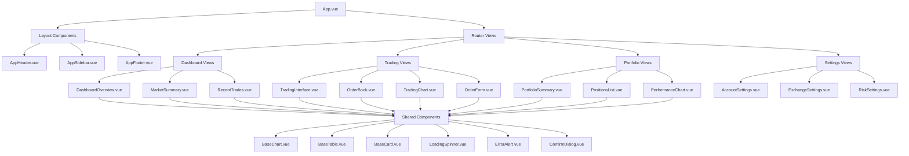

# Vue.js Frontend Specification

## Frontend Architecture Overview

**Framework**: Vue.js 3.3+ with Composition API  
**Language**: TypeScript 5.0+  
**UI Framework**: Vuetify 3.4+ (Material Design)  
**State Management**: Pinia 2.1+  
**Build Tool**: Vite 4.0+  
**Mobile**: Quasar Framework 2.14+ with Capacitor  

## Component Architecture Diagram



## Component Hierarchy Structure

```
src/
├── components/
│   ├── layout/
│   │   ├── AppHeader.vue
│   │   ├── AppSidebar.vue
│   │   ├── AppFooter.vue
│   │   └── AppLayout.vue
│   ├── dashboard/
│   │   ├── DashboardOverview.vue
│   │   ├── MarketSummary.vue
│   │   ├── RecentTrades.vue
│   │   ├── PortfolioWidget.vue
│   │   └── AlertsWidget.vue
│   ├── trading/
│   │   ├── TradingInterface.vue
│   │   ├── OrderBook.vue
│   │   ├── TradingChart.vue
│   │   ├── OrderForm.vue
│   │   ├── OrderHistory.vue
│   │   └── MarketDepth.vue
│   ├── portfolio/
│   │   ├── PortfolioSummary.vue
│   │   ├── PositionsList.vue
│   │   ├── PerformanceChart.vue
│   │   ├── AssetAllocation.vue
│   │   └── PnLAnalysis.vue
│   ├── settings/
│   │   ├── AccountSettings.vue
│   │   ├── ExchangeSettings.vue
│   │   ├── RiskSettings.vue
│   │   ├── NotificationSettings.vue
│   │   └── SecuritySettings.vue
│   ├── shared/
│   │   ├── BaseChart.vue
│   │   ├── BaseTable.vue
│   │   ├── BaseCard.vue
│   │   ├── LoadingSpinner.vue
│   │   ├── ErrorAlert.vue
│   │   ├── ConfirmDialog.vue
│   │   ├── CurrencyInput.vue
│   │   └── PriceDisplay.vue
│   └── ai/
│       ├── ChatInterface.vue
│       ├── CommandSuggestions.vue
│       ├── AIInsights.vue
│       └── SignalAnalysis.vue
├── views/
│   ├── Dashboard.vue
│   ├── Trading.vue
│   ├── Portfolio.vue
│   ├── Settings.vue
│   ├── Login.vue
│   └── Register.vue
├── stores/
│   ├── auth.ts
│   ├── trading.ts
│   ├── portfolio.ts
│   ├── market.ts
│   └── settings.ts
├── services/
│   ├── api.ts
│   ├── websocket.ts
│   ├── auth.ts
│   └── notifications.ts
├── types/
│   ├── trading.ts
│   ├── portfolio.ts
│   ├── market.ts
│   └── user.ts
└── utils/
    ├── formatters.ts
    ├── validators.ts
    ├── constants.ts
    └── helpers.ts
```

## Core Component Specifications

### 1. Layout Components

#### AppHeader.vue
| Property | Type | Description | Default |
|----------|------|-------------|----------|
| `user` | `User \| null` | Current authenticated user | `null` |
| `notifications` | `Notification[]` | User notifications | `[]` |
| `isLoading` | `boolean` | Loading state | `false` |

**Features:**
- User profile dropdown
- Notification bell with badge
- Real-time connection status
- Theme toggle (dark/light)
- Quick search functionality

#### AppSidebar.vue
| Property | Type | Description | Default |
|----------|------|-------------|----------|
| `collapsed` | `boolean` | Sidebar collapsed state | `false` |
| `activeRoute` | `string` | Current active route | `''` |
| `permissions` | `string[]` | User permissions | `[]` |

**Features:**
- Collapsible navigation menu
- Role-based menu items
- Active route highlighting
- Responsive design

### 2. Dashboard Components

#### DashboardOverview.vue
| Property | Type | Description | Default |
|----------|------|-------------|----------|
| `portfolioValue` | `number` | Total portfolio value | `0` |
| `dailyPnL` | `number` | Daily profit/loss | `0` |
| `activePositions` | `Position[]` | Current positions | `[]` |
| `recentTrades` | `Trade[]` | Recent trade history | `[]` |

**Chart Integration:**
```typescript
// Portfolio value chart
const portfolioChartOptions = {
  chart: {
    type: 'line',
    height: 300,
    animations: {
      enabled: true
    }
  },
  series: [{
    name: 'Portfolio Value',
    data: portfolioHistory.value
  }],
  xaxis: {
    type: 'datetime'
  },
  yaxis: {
    labels: {
      formatter: (value: number) => formatCurrency(value)
    }
  }
}
```

#### MarketSummary.vue
| Property | Type | Description | Default |
|----------|------|-------------|----------|
| `marketData` | `MarketData[]` | Market overview data | `[]` |
| `selectedTimeframe` | `string` | Chart timeframe | `'24h'` |
| `autoRefresh` | `boolean` | Auto-refresh enabled | `true` |

### 3. Trading Components

#### TradingInterface.vue
| Property | Type | Description | Default |
|----------|------|-------------|----------|
| `selectedPair` | `string` | Trading pair | `'BTC/USDT'` |
| `orderType` | `OrderType` | Order type | `'market'` |
| `orderSide` | `OrderSide` | Buy/Sell | `'buy'` |
| `amount` | `number` | Order amount | `0` |
| `price` | `number` | Order price | `0` |

**Component Structure:**
```vue
<template>
  <v-container fluid>
    <v-row>
      <v-col cols="12" md="8">
        <TradingChart :symbol="selectedPair" />
      </v-col>
      <v-col cols="12" md="4">
        <OrderForm 
          :symbol="selectedPair"
          @order-submitted="handleOrderSubmit"
        />
        <OrderBook :symbol="selectedPair" />
      </v-col>
    </v-row>
  </v-container>
</template>
```

#### TradingChart.vue
| Property | Type | Description | Default |
|----------|------|-------------|----------|
| `symbol` | `string` | Trading symbol | `'BTC/USDT'` |
| `timeframe` | `string` | Chart timeframe | `'1h'` |
| `indicators` | `string[]` | Technical indicators | `[]` |
| `height` | `number` | Chart height | `400` |

**Chart Configuration:**
```typescript
const chartOptions = ref({
  chart: {
    type: 'candlestick',
    height: props.height,
    toolbar: {
      show: true,
      tools: {
        download: true,
        selection: true,
        zoom: true,
        zoomin: true,
        zoomout: true,
        pan: true,
        reset: true
      }
    }
  },
  series: [{
    name: 'Price',
    data: candlestickData.value
  }],
  xaxis: {
    type: 'datetime'
  },
  yaxis: {
    tooltip: {
      enabled: true
    },
    labels: {
      formatter: (value: number) => formatPrice(value)
    }
  }
})
```

### 4. Portfolio Components

#### PortfolioSummary.vue
| Property | Type | Description | Default |
|----------|------|-------------|----------|
| `totalValue` | `number` | Total portfolio value | `0` |
| `totalPnL` | `number` | Total profit/loss | `0` |
| `positions` | `Position[]` | Portfolio positions | `[]` |
| `performance` | `PerformanceData` | Performance metrics | `{}` |

#### PerformanceChart.vue
| Property | Type | Description | Default |
|----------|------|-------------|----------|
| `timeRange` | `string` | Performance time range | `'30d'` |
| `chartType` | `string` | Chart type | `'line'` |
| `showBenchmark` | `boolean` | Show benchmark comparison | `false` |

### 5. Shared Components

#### BaseChart.vue
| Property | Type | Description | Default |
|----------|------|-------------|----------|
| `type` | `ChartType` | Chart type | `'line'` |
| `data` | `ChartData` | Chart data | `{}` |
| `options` | `ChartOptions` | Chart options | `{}` |
| `height` | `number` | Chart height | `300` |
| `loading` | `boolean` | Loading state | `false` |

**Generic Chart Interface:**
```typescript
interface ChartData {
  labels?: string[]
  datasets: {
    label: string
    data: number[]
    backgroundColor?: string
    borderColor?: string
    [key: string]: any
  }[]
}

interface ChartOptions {
  responsive?: boolean
  maintainAspectRatio?: boolean
  plugins?: {
    legend?: any
    tooltip?: any
  }
  scales?: any
  [key: string]: any
}
```

#### BaseTable.vue
| Property | Type | Description | Default |
|----------|------|-------------|----------|
| `headers` | `TableHeader[]` | Table headers | `[]` |
| `items` | `any[]` | Table data | `[]` |
| `loading` | `boolean` | Loading state | `false` |
| `sortBy` | `string` | Sort column | `''` |
| `sortDesc` | `boolean` | Sort direction | `false` |
| `itemsPerPage` | `number` | Pagination size | `10` |

## State Management (Pinia Stores)

### Trading Store
```typescript
export const useTradingStore = defineStore('trading', () => {
  // State
  const selectedPair = ref('BTC/USDT')
  const orderBook = ref<OrderBookData | null>(null)
  const recentTrades = ref<Trade[]>([])
  const openOrders = ref<Order[]>([])
  const orderHistory = ref<Order[]>([])
  const isLoading = ref(false)
  
  // Getters
  const bestBid = computed(() => 
    orderBook.value?.bids[0]?.price || 0
  )
  
  const bestAsk = computed(() => 
    orderBook.value?.asks[0]?.price || 0
  )
  
  const spread = computed(() => 
    bestAsk.value - bestBid.value
  )
  
  // Actions
  const submitOrder = async (orderData: OrderRequest) => {
    isLoading.value = true
    try {
      const response = await api.post('/orders', orderData)
      openOrders.value.push(response.data)
      return response.data
    } catch (error) {
      throw error
    } finally {
      isLoading.value = false
    }
  }
  
  const cancelOrder = async (orderId: string) => {
    try {
      await api.delete(`/orders/${orderId}`)
      openOrders.value = openOrders.value.filter(o => o.id !== orderId)
    } catch (error) {
      throw error
    }
  }
  
  const fetchOrderBook = async (symbol: string) => {
  try {
    // Fetch order book data from external exchange via our API
    const response = await api.get(`/market/orderbook/${symbol}`)
    orderBook.value = response.data
  } catch (error) {
    console.error('Failed to fetch order book from exchange:', error)
  }
}
  
  return {
    // State
    selectedPair,
    orderBook,
    recentTrades,
    openOrders,
    orderHistory,
    isLoading,
    // Getters
    bestBid,
    bestAsk,
    spread,
    // Actions
    submitOrder,
    cancelOrder,
    fetchOrderBook
  }
})
```

### Portfolio Store
```typescript
export const usePortfolioStore = defineStore('portfolio', () => {
  // State
  const positions = ref<Position[]>([])
  const totalValue = ref(0)
  const totalPnL = ref(0)
  const dailyPnL = ref(0)
  const performance = ref<PerformanceData[]>([])
  
  // Getters
  const totalPnLPercentage = computed(() => 
    totalValue.value > 0 ? (totalPnL.value / totalValue.value) * 100 : 0
  )
  
  const dailyPnLPercentage = computed(() => 
    totalValue.value > 0 ? (dailyPnL.value / totalValue.value) * 100 : 0
  )
  
  const assetAllocation = computed(() => 
    positions.value.map(position => ({
      symbol: position.symbol,
      value: position.value,
      percentage: (position.value / totalValue.value) * 100
    }))
  )
  
  // Actions
  const fetchPortfolio = async () => {
    try {
      const response = await api.get('/portfolio')
      const data = response.data
      
      positions.value = data.positions
      totalValue.value = data.totalValue
      totalPnL.value = data.totalPnL
      dailyPnL.value = data.dailyPnL
    } catch (error) {
      console.error('Failed to fetch portfolio:', error)
    }
  }
  
  const fetchPerformance = async (timeRange: string) => {
    try {
      const response = await api.get(`/portfolio/performance?range=${timeRange}`)
      performance.value = response.data
    } catch (error) {
      console.error('Failed to fetch performance:', error)
    }
  }
  
  return {
    // State
    positions,
    totalValue,
    totalPnL,
    dailyPnL,
    performance,
    // Getters
    totalPnLPercentage,
    dailyPnLPercentage,
    assetAllocation,
    // Actions
    fetchPortfolio,
    fetchPerformance
  }
})
```

## WebSocket Integration

### Real-time Data Service
```typescript
import { io, Socket } from 'socket.io-client'
import { useTradingStore } from '@/stores/trading'
import { usePortfolioStore } from '@/stores/portfolio'

class WebSocketService {
  private socket: Socket | null = null
  private tradingStore = useTradingStore()
  private portfolioStore = usePortfolioStore()
  
  connect() {
    this.socket = io(import.meta.env.VITE_WS_URL, {
      auth: {
        token: localStorage.getItem('auth_token')
      }
    })
    
    this.setupEventListeners()
  }
  
  private setupEventListeners() {
    if (!this.socket) return
    
    // Price updates
    this.socket.on('price_update', (data) => {
      // Update trading store with new prices
    })
    
    // Order book updates
    this.socket.on('orderbook_update', (data) => {
      this.tradingStore.orderBook = data
    })
    
    // Portfolio updates
    this.socket.on('portfolio_update', (data) => {
      this.portfolioStore.totalValue = data.totalValue
      this.portfolioStore.totalPnL = data.totalPnL
    })
    
    // Order updates
    this.socket.on('order_update', (data) => {
      const index = this.tradingStore.openOrders.findIndex(o => o.id === data.id)
      if (index !== -1) {
        this.tradingStore.openOrders[index] = data
      }
    })
  }
  
  subscribeToSymbol(symbol: string) {
    this.socket?.emit('subscribe', { symbol })
  }
  
  unsubscribeFromSymbol(symbol: string) {
    this.socket?.emit('unsubscribe', { symbol })
  }
  
  disconnect() {
    this.socket?.disconnect()
    this.socket = null
  }
}

export const wsService = new WebSocketService()
```

## Mobile App (Quasar Framework)

### Quasar Configuration
```typescript
// quasar.config.js
const { configure } = require('quasar/wrappers')

module.exports = configure((ctx) => {
  return {
    supportTS: {
      tsCheckerConfig: {
        eslint: {
          enabled: true,
          files: './src/**/*.{ts,tsx,js,jsx,vue}'
        }
      }
    },
    
    preFetch: true,
    
    app: {
      head: {
        title: 'Crypto Trading Bot',
        meta: [
          { charset: 'utf-8' },
          { name: 'viewport', content: 'width=device-width, initial-scale=1' }
        ]
      }
    },
    
    css: [
      'app.scss'
    ],
    
    extras: [
      'roboto-font',
      'material-icons'
    ],
    
    build: {
      target: {
        browser: ['es2019', 'edge88', 'firefox78', 'chrome87', 'safari13.1'],
        node: 'node16'
      },
      
      vueRouterMode: 'hash',
      
      vitePlugins: [
        ['@intlify/vite-plugin-vue-i18n', {
          include: path.resolve(__dirname, './src/i18n/**')
        }]
      ]
    },
    
    devServer: {
      open: true
    },
    
    framework: {
      config: {},
      
      plugins: [
        'Notify',
        'Dialog',
        'Loading',
        'LocalStorage',
        'SessionStorage'
      ]
    },
    
    animations: [],
    
    ssr: {
      pwa: false,
      prodPort: 3000,
      middlewares: [
        'render'
      ]
    },
    
    pwa: {
      workboxMode: 'generateSW',
      injectPwaMetaTags: true,
      swFilename: 'sw.js',
      manifestFilename: 'manifest.json',
      useCredentialsForManifestTag: false
    },
    
    cordova: {},
    
    capacitor: {
      hideSplashscreen: true
    },
    
    electron: {
      inspectPort: 5858,
      bundler: 'packager',
      packager: {},
      builder: {
        appId: 'crypto-trading-bot'
      }
    },
    
    bex: {
      contentScripts: [
        'my-content-script'
      ]
    }
  }
})
```

## Performance Optimization

### Component Lazy Loading
```typescript
// router/index.ts
const routes = [
  {
    path: '/',
    component: () => import('@/layouts/MainLayout.vue'),
    children: [
      {
        path: '',
        component: () => import('@/views/Dashboard.vue')
      },
      {
        path: '/trading',
        component: () => import('@/views/Trading.vue')
      },
      {
        path: '/portfolio',
        component: () => import('@/views/Portfolio.vue')
      }
    ]
  }
]
```

### Chart Performance
```typescript
// Optimize chart rendering for large datasets
const optimizeChartData = (data: any[], maxPoints: number = 1000) => {
  if (data.length <= maxPoints) return data
  
  const step = Math.ceil(data.length / maxPoints)
  return data.filter((_, index) => index % step === 0)
}

// Use virtual scrolling for large tables
const tableOptions = {
  virtualRows: true,
  rowHeight: 48,
  visibleRows: 20
}
```

## Testing Strategy

### Component Testing
```typescript
// tests/components/TradingChart.spec.ts
import { mount } from '@vue/test-utils'
import { createVuetify } from 'vuetify'
import TradingChart from '@/components/trading/TradingChart.vue'

describe('TradingChart.vue', () => {
  let vuetify: any
  
  beforeEach(() => {
    vuetify = createVuetify()
  })
  
  it('renders chart with correct symbol', () => {
    const wrapper = mount(TradingChart, {
      props: {
        symbol: 'BTC/USDT'
      },
      global: {
        plugins: [vuetify]
      }
    })
    
    expect(wrapper.find('[data-testid="chart-title"]').text()).toContain('BTC/USDT')
  })
  
  it('updates chart when symbol changes', async () => {
    const wrapper = mount(TradingChart, {
      props: {
        symbol: 'BTC/USDT'
      },
      global: {
        plugins: [vuetify]
      }
    })
    
    await wrapper.setProps({ symbol: 'ETH/USDT' })
    
    expect(wrapper.find('[data-testid="chart-title"]').text()).toContain('ETH/USDT')
  })
})
```

## Build and Deployment

### Vite Configuration
```typescript
// vite.config.ts
import { defineConfig } from 'vite'
import vue from '@vitejs/plugin-vue'
import vuetify from 'vite-plugin-vuetify'
import { resolve } from 'path'

export default defineConfig({
  plugins: [
    vue(),
    vuetify({ autoImport: true })
  ],
  resolve: {
    alias: {
      '@': resolve(__dirname, 'src')
    }
  },
  build: {
    rollupOptions: {
      output: {
        manualChunks: {
          vendor: ['vue', 'vue-router', 'pinia'],
          ui: ['vuetify'],
          charts: ['chart.js', 'apexcharts']
        }
      }
    }
  },
  server: {
    proxy: {
      '/api': {
        target: 'http://localhost:8000',
        changeOrigin: true
      },
      '/ws': {
        target: 'ws://localhost:8000',
        ws: true
      }
    }
  }
})
```

### Docker Configuration
```dockerfile
# Frontend Dockerfile
FROM node:18-alpine as build-stage

WORKDIR /app

COPY package*.json ./
RUN npm ci --only=production

COPY . .
RUN npm run build

FROM nginx:alpine as production-stage

COPY --from=build-stage /app/dist /usr/share/nginx/html
COPY nginx.conf /etc/nginx/nginx.conf

EXPOSE 80

CMD ["nginx", "-g", "daemon off;"]
```

This comprehensive Vue.js frontend specification provides a complete architecture for the crypto trading bot interface with detailed component specifications, state management, real-time data integration, and mobile support using Quasar Framework.